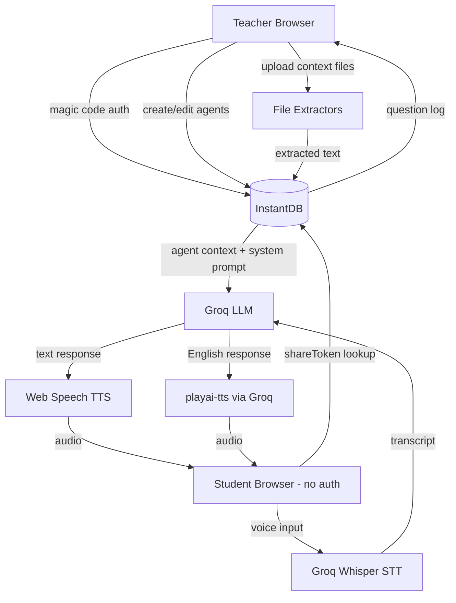

# PRD — Nuru

> **Note:** Visual design tokens (colors, typography, spacing, components, motion) are not yet defined. Run `/plaid design` with image references before implementation begins to generate `docs/design.md`.

---

## 1. Overview

### Product Summary

**Nuru** — "Nuru lets any teacher deploy AI tutors so every student gets the individual attention only first-world schools have had — until now."

Nuru is a teacher-facing AI voice agent builder backed by InstantDB and Groq. Teachers create configurable AI tutors ("agents") for specific subjects and grade levels, upload their own curriculum context, and get a QR code and link students can access from any device with a browser — no login, no app, no cost. Students talk to the AI tutor in their own language. Teachers see what their students asked.

### Objective

This PRD covers the MVP: everything required to get a teacher in a low-resource environment to a working, shareable AI tutor in under 10 minutes, and keep them coming back because they can see what their students are learning. Scope is as defined in `docs/product-vision.md § MVP Definition`.

### Market Differentiation

The technical implementation must deliver three structural advantages that no current competitor offers together: zero student friction (QR code → talking to a tutor, no account), teacher-grounded context (the AI answers from uploaded materials, not the open internet), and compute efficiency (Groq free tier handles meaningful scale without spending money). Every architectural decision must protect these three properties.

### Magic Moment

A teacher in Nairobi creates an agent for Grade 5 science in under 10 minutes, prints the QR code, and a student scans it on a shared phone, asks a question in Swahili, and gets a clear, patient answer. For this to happen reliably: agent creation must be under 4 fields with sensible defaults, context processing must complete within 60 seconds, the student interface must load on 3G, the first AI greeting must reference the subject and grade level, and TTS must speak in the configured language.

### Success Criteria

- Time from sign-up to working agent: < 10 minutes for a first-time teacher
- Time from QR code scan to first AI response: < 8 seconds on 3G
- Page load (student interface): < 3s on 3G (LCP)
- Agent creation completion rate: > 70% of teachers who start the form
- TTS functional in configured language: 100% of created agents
- All P0 functional requirements working without errors

---

## 2. Technical Architecture

### Architecture Overview



### Chosen Stack

| Layer | Choice | Rationale |
|---|---|---|
| Frontend | Expo (React Native Web) | Already built. Web-first = no app download. Works on any browser, any device. |
| Backend/DB | InstantDB | Real-time sync, generous free tier, magic code auth built in. Zero backend infrastructure. |
| Database | InstantDB | Included. Real-time reactive queries, offline support, no separate DB. |
| Auth | InstantDB Magic Code | Email-based, no password. Teachers only — students need zero auth. |
| LLM | Groq (llama-3.1-8b-instant) | Fast, cheap, free tier. Context-grounded answers. |
| STT | Groq Whisper | Better accuracy than browser SpeechRecognition, multilingual, cross-platform. |
| TTS (multilingual) | Web Speech API (primary) | Free, built-in, 40+ languages, works on device. |
| TTS (English) | playai-tts via Groq | Higher quality English voice for English-configured agents. |
| Payments | None | Free forever. |

### Stack Integration Guide

**Setup order:**
1. InstantDB app ID and admin token in `.env` → `EXPO_PUBLIC_INSTANT_APP_ID`, `INSTANT_APP_ADMIN_TOKEN`
2. Groq API key → `EXPO_PUBLIC_GROQ_API_KEY`
3. `npx instant-cli push schema --yes` after every schema change
4. `npx instant-cli push perms --yes` after every permissions change

**Known integration patterns:**
- InstantDB client is initialized in `lib/db.ts` with `init({ appId, schema })` — always pass the schema for type safety
- Use `db.useQuery()` for reactive data, `db.transact()` for writes
- Student interface reads agent by `shareToken` using `db.useQuery({ agents: { $: { where: { shareToken: token } } } })` — shareToken must be indexed (it is)
- Groq Whisper: use `client.audio.transcriptions.create({ model: 'whisper-large-v3-turbo', file, response_format: 'text' })` — capture mic audio as a Blob, send to Groq
- Web Speech TTS: `window.speechSynthesis.speak(new SpeechSynthesisUtterance(text))` — set `utterance.lang` to the agent's BCP-47 language code
- playai-tts: use only when agent language is English (`lang === 'en'` or `language === 'English'`)

**Required environment variables:**

```
EXPO_PUBLIC_INSTANT_APP_ID=
INSTANT_APP_ADMIN_TOKEN=
EXPO_PUBLIC_GROQ_API_KEY=
EXPO_PUBLIC_GOOGLE_CLIENT_ID=   # optional, Google OAuth
```

**Common gotchas:**
- InstantDB fields used in `where` or `order` MUST be indexed in `instant.schema.ts`. `shareToken` and `createdAt` are indexed; add indexes before using new fields in queries.
- `data.ref(...)` in permissions always returns a list — never compare to a scalar.
- Web Speech API requires user gesture before first `speak()` call. The student must tap the mic or a button before TTS fires.
- Groq Whisper requires audio as a `File` or `Blob` with a MIME type — use `audio/webm` for browser MediaRecorder output.
- Expo web uses React Native Web — not all web APIs are available via React Native wrappers. Use `Platform.OS === 'web'` guards and access browser APIs via `window` directly.

### Repository Structure

```
awesome-todos/
├── app/
│   ├── _layout.tsx              # Root layout, auth redirect logic
│   ├── index.tsx                # Root redirect: auth → teacher, else → login
│   ├── (auth)/
│   │   └── login.tsx            # Magic code email auth
│   ├── (teacher)/
│   │   ├── index.tsx            # Teacher dashboard — agent list
│   │   ├── create.tsx           # New agent form
│   │   ├── agents/
│   │   │   └── [id].tsx         # Agent detail / edit / share QR
│   │   └── settings.tsx         # Sign-out
│   └── student/
│       └── [token].tsx          # Student voice chat — public, no auth
├── lib/
│   ├── db.ts                    # InstantDB client init
│   ├── groq.ts                  # Groq LLM, Whisper STT, TTS
│   ├── curriculum-library.ts    # Bundled curriculum entries
│   └── extractors/
│       ├── index.ts             # combineAndTruncate, orchestrator
│       ├── pdf.ts               # PDF extraction (browser File API)
│       ├── docx.ts              # DOCX extraction
│       ├── youtube.ts           # YouTube transcript extraction
│       └── url.ts               # URL content extraction
├── instant.schema.ts            # InstantDB schema
├── instant.perms.ts             # InstantDB permissions
├── docs/                        # PLAID-generated product docs
├── vision.json                  # PLAID vision intake
├── .env                         # Environment variables (not committed)
├── package.json
└── tsconfig.json
```

### Infrastructure & Deployment

**Recommended:** Deploy via Expo's web export to any static host. Vercel is the path of least resistance — `npx expo export --platform web` then deploy the `dist/` folder.

InstantDB and Groq are fully managed services — no server to provision. The only infrastructure is static file hosting.

**Deployment checklist:**
1. Set all env vars in Vercel dashboard (not the `INSTANT_APP_ADMIN_TOKEN` — that is CLI-only)
2. `npx expo export --platform web` → deploy `dist/`
3. Verify `EXPO_PUBLIC_*` vars are present in the build
4. Test QR code on a real mobile device on 3G before calling it shipped

### Security Considerations

- **Student access:** controlled entirely by `shareToken` — a UUID generated at agent creation. Anyone with the token can access the agent. This is by design. Teachers can regenerate the token if needed (future feature).
- **Teacher data:** protected by InstantDB auth. The `teacherAgents` link ensures only the owner teacher can update or delete their agents (enforced in `instant.perms.ts`).
- **Groq API key:** exposed as `EXPO_PUBLIC_GROQ_API_KEY` — this is client-side. Acceptable for the current free-tier model. If abuse becomes a concern, proxy Groq calls through a server function.
- **No student data stored beyond question log:** conversations are not persisted in full. Only the student's question text and timestamp are stored.
- **Input validation:** sanitize all teacher-supplied text (agent name, system prompt) before storing. Reject uploads over 10MB. Truncate context to ≈18k characters via `combineAndTruncate` before storing in `contextText`.

### Cost Estimate (monthly, < 500 active teachers)

| Service | Free Tier | Estimated Usage | Cost |
|---|---|---|---|
| InstantDB | Generous free tier | < 1GB storage, < 10k MAU | $0 |
| Groq LLM | Free tier | ~50k requests/month | $0 |
| Groq Whisper | $0.00/min free, $0.02/min paid | ~2,000 min/month at scale | ~$40 |
| Vercel hosting | Free tier | Static site | $0 |
| **Total** | | | **~$0–$40/month** |

Budget risk: Groq Whisper is the only real cost at scale. At 500 active teachers with 10 student sessions/week at 2 min each: 10,000 min/month = ~$200. Apply for Groq's nonprofit/education program before hitting the free tier ceiling. Include this cost in grant applications.

---

## 3. Data Model

### Entity Definitions

**`$users` (built-in InstantDB, extended):**
```typescript
$users: i.entity({
  email: i.string().unique().indexed().optional(),
  imageURL: i.string().optional(),
  type: i.string().optional(),   // reserved for future role management
})
```

**`agents`:**
```typescript
agents: i.entity({
  name: i.string(),                    // Agent display name, required
  subject: i.string(),                 // Subject area, e.g. "Mathematics"
  systemPrompt: i.string(),            // Full assembled system prompt
  contextText: i.string().optional(),  // Extracted course material, ≤ ~18k chars
  contextSources: i.string().optional(), // JSON: Array<{ type: string, label: string }>
  gradeLevel: i.string(),              // "elementary" | "middle" | "high"
  language: i.string(),                // Display name: "English", "Swahili", etc.
  shareToken: i.string().unique().indexed(), // UUID — student access key
  createdAt: i.number().indexed(),     // Unix ms timestamp
})
```

**`questionLog` (to be added to schema):**
```typescript
questionLog: i.entity({
  agentId: i.string().indexed(),       // Reference to agents entity ID
  question: i.string(),                // Student's question text
  createdAt: i.number().indexed(),     // Unix ms timestamp
})
```

**`$files` (InstantDB Storage, reserved for future file uploads):**
```typescript
$files: i.entity({
  path: i.string().unique().indexed(),
  url: i.string(),
})
```

### Relationships

- `teacherAgents`: `$users` (one teacher) → `agents` (many agents). Cascade: deleting a teacher account should delete their agents.
- `questionLog`: linked to `agents` by `agentId` field (string field reference, not a formal InstantDB link — simpler query pattern for append-only logs).

**Schema addition needed:** Add `questionLog` entity and push schema before implementing the question log feature.

### Indexes

| Field | Entity | Reason |
|---|---|---|
| `shareToken` | `agents` | Student lookup by token — high frequency, must be fast |
| `createdAt` | `agents` | Teacher dashboard sorted by creation date |
| `email` | `$users` | Auth lookup |
| `agentId` | `questionLog` | Filter question log by agent |
| `createdAt` | `questionLog` | Sort questions chronologically |

---

## 4. API Specification

### API Design Philosophy

Nuru uses InstantDB's reactive query model (`db.useQuery`) for reads and InstaML (`db.transact`) for writes. There are no traditional REST endpoints — all data operations go through the InstantDB SDK. External API calls (Groq LLM, Groq Whisper) are made directly from the client using the Groq SDK.

### InstantDB Queries

**Get all agents for current teacher (dashboard):**
```typescript
db.useQuery({
  agents: {
    $: { order: { createdAt: 'desc' } }
  }
})
// Returns agents linked to the authenticated user via teacherAgents link
```

**Get agent by shareToken (student interface):**
```typescript
db.useQuery({
  agents: {
    $: { where: { shareToken: token } }
  }
})
```

**Get question log for an agent:**
```typescript
db.useQuery({
  questionLog: {
    $: {
      where: { agentId: agentId },
      order: { createdAt: 'desc' },
      limit: 50
    }
  }
})
```

### InstantDB Mutations

**Create agent:**
```typescript
const agentId = id();
db.transact(
  db.tx.agents[agentId]
    .update({
      name,
      subject,
      systemPrompt: buildSystemPrompt({ name, subject, gradeLevel, language, contextText }),
      contextText,
      contextSources: JSON.stringify(contextSources),
      gradeLevel,
      language,
      shareToken: generateShareToken(), // crypto.randomUUID()
      createdAt: Date.now(),
    })
    .link({ teacher: user.id })
);
```

**Update agent:**
```typescript
db.transact(
  db.tx.agents[agentId].update({ name, subject, systemPrompt, contextText, contextSources, gradeLevel, language })
);
```

**Delete agent:**
```typescript
db.transact(db.tx.agents[agentId].delete());
```

**Log student question:**
```typescript
db.transact(
  db.tx.questionLog[id()].update({
    agentId,
    question: studentQuestion,
    createdAt: Date.now(),
  })
);
```

### Groq API Calls

**Groq Whisper STT:**
```typescript
const transcription = await groqClient.audio.transcriptions.create({
  file: new File([audioBlob], 'audio.webm', { type: 'audio/webm' }),
  model: 'whisper-large-v3-turbo',
  response_format: 'text',
  language: getBCP47LanguageCode(agent.language), // optional but improves accuracy
});
```

**Groq LLM (chat completion):**
```typescript
const completion = await groqClient.chat.completions.create({
  model: 'llama-3.1-8b-instant',
  messages: [
    { role: 'system', content: agent.systemPrompt },
    ...conversationHistory,
    { role: 'user', content: studentQuestion }
  ],
  max_tokens: 400,
  temperature: 0.7,
});
```

---

## 5. User Stories

### Epic: Teacher Authentication

**US-001: Sign up with magic code**
As a teacher (Amara), I want to sign in with just my email address so that I don't have to remember a password.

Acceptance Criteria:
- [ ] Given I enter my email, when I submit, then I receive a 6-digit code within 30 seconds
- [ ] Given I enter the correct code, when I submit, then I am logged in and redirected to the dashboard
- [ ] Given I enter an incorrect code, when I submit, then I see a clear error and can retry
- [ ] Edge case: code expires after 15 minutes → prompt to request a new one

---

### Epic: Agent Creation

**US-002: Create an AI tutor agent**
As a teacher, I want to create an AI tutor for a specific subject and grade level so that my students can access personalized help.

Acceptance Criteria:
- [ ] Given I'm on the create page, when I fill in name, subject, grade level, and language, then I can submit the form
- [ ] Given I submit, when processing completes, then I see a QR code and shareable link within 60 seconds
- [ ] Given I haven't uploaded context, when I create an agent, then the agent uses the curriculum library defaults
- [ ] Edge case: form submitted with empty required fields → inline validation errors, no submission

**US-003: Upload curriculum context**
As a teacher, I want to upload my own materials so that the AI tutor teaches what I actually teach.

Acceptance Criteria:
- [ ] Given I'm creating an agent, when I upload a PDF (< 10MB), then the text is extracted and stored
- [ ] Given I paste a YouTube URL, when I submit, then the transcript is extracted and stored
- [ ] Given I paste a web URL, when I submit, then the page content is extracted and stored
- [ ] Given I upload a Word document, when I submit, then the text is extracted and stored
- [ ] Edge case: file > 10MB → error message, no upload
- [ ] Edge case: YouTube video has no captions → fallback message, agent still creates

**US-004: Select from curriculum library**
As a teacher, I want to pick pre-vetted curriculum materials so that I don't have to upload everything from scratch.

Acceptance Criteria:
- [ ] Given I'm creating an agent, when I browse the library, then I see materials filtered by subject and grade level
- [ ] Given I select library items, when I create the agent, then the selected materials are combined with any uploaded context

---

### Epic: Agent Management

**US-005: View all my agents**
As a teacher, I want to see all the AI tutors I've created so that I can manage and share them.

Acceptance Criteria:
- [ ] Given I'm on the dashboard, when agents exist, then I see them sorted by creation date (newest first)
- [ ] Given I'm on the dashboard, when no agents exist, then I see an empty state with a prompt to create the first one
- [ ] Given I tap an agent, when the detail page loads, then I see the QR code and share link

**US-006: Share agent with students**
As a teacher, I want to share a QR code and link so that my students can access the tutor without any setup.

Acceptance Criteria:
- [ ] Given I'm on the agent detail page, when I view the QR code, then scanning it opens the student interface
- [ ] Given I tap the share link, when it copies, then pasting it in a browser opens the student interface
- [ ] Given the student opens the link, when the page loads, then no login or account creation is required

**US-007: Edit an agent**
As a teacher, I want to update my agent's context or settings so that I can improve it over time.

Acceptance Criteria:
- [ ] Given I'm on the agent detail page, when I tap edit, then I can change any field
- [ ] Given I save changes, when the update completes, then the student interface reflects the changes immediately (real-time)

**US-008: Delete an agent**
As a teacher, I want to delete an agent I no longer need.

Acceptance Criteria:
- [ ] Given I'm on the agent detail page, when I tap delete, then I see a confirmation prompt
- [ ] Given I confirm, when deletion completes, then the agent is removed and the share link stops working
- [ ] Edge case: deleting an agent mid-conversation does not crash the student's session — show a graceful "tutor no longer available" message

---

### Epic: Student Voice Interface

**US-009: Start a conversation with an AI tutor**
As a student, I want to scan a QR code and immediately start talking to a tutor so that I can get help without setting up an account.

Acceptance Criteria:
- [ ] Given I scan the QR code, when the page loads, then I see the tutor's subject name and a greeting
- [ ] Given the page loads, when I tap the microphone, then I can speak my question
- [ ] Given I speak, when Whisper transcribes my input, then I see my question in text and hear the AI's response
- [ ] Edge case: microphone permission denied → show text input fallback

**US-010: Hear the AI tutor respond in my language**
As a student, I want the tutor to speak in the language my teacher configured so that I can understand the answers.

Acceptance Criteria:
- [ ] Given the agent is configured for Swahili, when the AI responds, then TTS speaks in Swahili
- [ ] Given the agent is configured for English, when the AI responds, then TTS uses playai-tts for higher quality
- [ ] Given TTS fails, when the error occurs, then the response text is displayed and a retry button appears

**US-011: Ask follow-up questions**
As a student, I want to continue a conversation so that I can dig deeper into a topic.

Acceptance Criteria:
- [ ] Given I've received a response, when I tap the microphone again, then I can ask a follow-up
- [ ] Given conversation history exists, when the AI responds, then it takes prior context into account
- [ ] Given the conversation is long, when it exceeds the context window, then earlier messages are gracefully truncated

---

### Epic: Teacher Visibility

**US-012: See what students asked**
As a teacher, I want to see the questions students asked my agents so that I can improve my lessons.

Acceptance Criteria:
- [ ] Given I'm on the agent detail page, when students have asked questions, then I see the last 50 questions with timestamps
- [ ] Given no students have used the agent, when I view the log, then I see an empty state: "No questions yet — share the QR code with your students"
- [ ] Given I view the log, when it loads, then it reflects activity within the last 60 seconds (real-time via InstantDB)

---

## 6. Functional Requirements

**FR-001: Magic Code Authentication**
Priority: P0
Description: Teachers can sign in with their email address using InstantDB's built-in magic code flow. No password required. Session persists until explicitly signed out.
Acceptance Criteria:
- Email input + submit → code sent within 30s
- Code input + submit → authenticated and redirected to dashboard
- Session persisted across browser refreshes
- Sign-out clears session and redirects to login
Related Stories: US-001

**FR-002: Agent Creation Form**
Priority: P0
Description: A 4-field form (name, subject, grade level, language) creates a new agent. All fields required. Language picker uses a predefined list of 12 supported languages. Grade level options: Elementary (K-6), Middle School (7-9), High School (10-12).
Acceptance Criteria:
- Form validates all fields before submission
- Submission creates agent in InstantDB with unique shareToken (crypto.randomUUID())
- System prompt assembled from fields and stored in `agents.systemPrompt`
- QR code and share link displayed within 60s of submission
Related Stories: US-002

**FR-003: Context Ingestion — File Upload**
Priority: P1
Description: Teachers can upload PDF or DOCX files. Text is extracted client-side using appropriate libraries. Combined with other sources and truncated to ≈18k characters before storage in `contextText`.
Acceptance Criteria:
- Accepts PDF and DOCX files up to 10MB
- Extraction runs in the browser (no server-side processing)
- Progress indicator during extraction
- Error displayed if extraction fails
Related Stories: US-003

**FR-004: Context Ingestion — YouTube Transcript**
Priority: P1
Description: Teachers paste a YouTube URL. The transcript is fetched and extracted. Uses youtube-transcript or equivalent package.
Acceptance Criteria:
- Validates URL is a YouTube link before fetching
- Extracts transcript text and appends to context sources
- Shows error if video has no captions
Related Stories: US-003

**FR-005: Context Ingestion — URL**
Priority: P1
Description: Teachers paste a web URL. Page content is fetched and extracted (text only, no images).
Acceptance Criteria:
- Fetches URL content and extracts readable text
- Appends to context sources
- Error if URL is unreachable or returns non-HTML content
Related Stories: US-003

**FR-006: Curriculum Library**
Priority: P1
Description: A curated set of bundled curriculum entries in `lib/curriculum-library.ts`. Displayed in the create/edit form filtered by subject and grade level. Selected entries merged into context.
Acceptance Criteria:
- Library entries filterable by subject and grade level
- Multiple entries selectable
- Selected entries combined with uploaded context before storage
Related Stories: US-004

**FR-007: Agent Dashboard**
Priority: P0
Description: Authenticated teachers see all their agents sorted by creation date. Each shows name, subject, and creation date. Tap to open detail/edit page.
Acceptance Criteria:
- Shows all agents linked to current user via teacherAgents
- Sorted newest first
- Empty state with CTA when no agents exist
- Real-time updates when agents are created/deleted
Related Stories: US-005

**FR-008: QR Code and Share Link**
Priority: P0
Description: Each agent gets a unique shareToken. Agent detail page displays a scannable QR code and a copyable share link pointing to `/student/[token]`. QR code generated client-side using react-native-qrcode-svg or equivalent.
Acceptance Criteria:
- QR code renders correctly and is scannable by standard QR readers
- Share link copies to clipboard on tap
- Link opens student interface without auth
Related Stories: US-006

**FR-009: Agent Edit**
Priority: P1
Description: Teachers can update any field of an existing agent. Context can be re-uploaded or added to. System prompt regenerated on save.
Acceptance Criteria:
- Loads existing values into form
- Saves only changed fields
- Student interface reflects changes immediately (InstantDB real-time)
Related Stories: US-007

**FR-010: Agent Delete**
Priority: P1
Description: Teachers can delete an agent after confirming. Deletion removes the agent and invalidates the share link.
Acceptance Criteria:
- Confirmation modal before deletion
- Agent removed from dashboard immediately
- Deleted agent's student URL shows "tutor not found" message
Related Stories: US-008

**FR-011: Student Voice Interface — Groq Whisper STT**
Priority: P0
Description: Student taps microphone button, MediaRecorder captures audio, audio sent to Groq Whisper for transcription. Transcribed text displayed and sent to LLM.
Acceptance Criteria:
- Microphone permission requested on first tap
- Recording starts immediately on tap, stops on second tap or silence detection
- Transcription returned within 3 seconds on normal connection
- Text input fallback shown when microphone permission denied
Related Stories: US-009

**FR-012: Student Voice Interface — LLM Response**
Priority: P0
Description: Transcribed student question + conversation history + agent system prompt sent to Groq LLM. Response streamed and displayed. Response logged to `questionLog`.
Acceptance Criteria:
- System prompt includes agent name, subject, grade level, contextText, and language instruction
- Conversation history passed (last N turns, truncated to stay within context window)
- Response streams progressively (not shown all at once)
- Question logged to questionLog after successful response
Related Stories: US-009, US-011

**FR-013: Student Voice Interface — TTS**
Priority: P0
Description: AI response spoken aloud. Language routing: English agents use playai-tts via Groq. All other languages use Web Speech API with the agent's configured language code.
Acceptance Criteria:
- TTS starts playing within 1 second of response completion
- Correct language spoken for agent's configured language
- Text displayed simultaneously (do not wait for TTS to finish before displaying)
- TTS can be interrupted by tapping the microphone to ask a follow-up
Related Stories: US-010

**FR-014: Question Log**
Priority: P1
Description: Agent detail page shows the last 50 questions students asked, with timestamps, in real-time via InstantDB reactive query.
Acceptance Criteria:
- Questions displayed newest first
- Timestamps shown in human-readable format (e.g. "2 hours ago")
- Empty state shown when no questions yet
- Updates without page refresh when new questions arrive
Related Stories: US-012

**FR-015: Multilingual TTS Language Mapping**
Priority: P0
Description: Map agent language names (e.g. "Swahili") to BCP-47 language codes (e.g. "sw") for Web Speech API. Maintain a mapping table in `lib/groq.ts` or a dedicated `lib/languages.ts`.
Acceptance Criteria:
- All 12 supported languages have valid BCP-47 codes
- Invalid/unmapped language falls back to "en" with a console warning
Related Stories: US-010

**FR-016: Sign Out**
Priority: P1
Description: Teacher can sign out from the settings page. Clears InstantDB auth session and redirects to login.
Acceptance Criteria:
- Settings page accessible from dashboard
- Sign out clears session immediately
- Redirected to login after sign out
Related Stories: (auth management)

---

## 7. Non-Functional Requirements

### Performance
- Student interface LCP: < 3 seconds on a simulated 3G connection (25 Mbps → 1.6 Mbps throttle)
- Time from QR scan to first AI greeting: < 8 seconds
- Groq Whisper response: < 3 seconds for clips under 30 seconds
- Groq LLM first token: < 2 seconds
- InstantDB reactive query update latency: < 500ms
- Initial JS bundle: < 300KB gzipped for student interface

### Security
- OWASP Top 10 addressed: no SQL injection (no SQL), no XSS (React escapes by default, no dangerouslySetInnerHTML), no CSRF (InstantDB handles)
- Groq API key is client-side — acceptable for free tier. Rate limit: if abuse detected, proxy through a Vercel Edge Function
- No full conversation content stored — only the student's question text
- InstantDB permissions enforce: anyone can read agents (for student access), only owner teacher can write/delete
- Context uploads validated: file size < 10MB, MIME type checked before processing

### Accessibility
- All interactive elements keyboard accessible
- ARIA labels on microphone button (aria-label changes between "Start recording" and "Stop recording")
- Sufficient color contrast for text (WCAG AA)
- TTS output is the primary modality — visual text is always displayed alongside audio
- Text input fallback always available for students who cannot use voice

### Scalability
- InstantDB free tier: handles up to 10k MAU — sufficient for 90-day goal
- Groq free tier: handles ~50k requests/month — sufficient for early traction
- No server-side compute to scale — all processing is client-side or managed services
- Static hosting on Vercel scales automatically

### Reliability
- Graceful degradation: if Groq is unavailable, show error and retry button — do not crash
- If TTS fails, display text response and allow manual retry
- If InstantDB sync is offline, show "reconnecting" indicator — do not lose data already loaded
- 99.5% uptime target (achieved via managed services — no self-hosted infrastructure)

---

## 8. UI/UX Requirements

> Visual design tokens (colors, typography, spacing, component styling) are not defined here. Run `/plaid design` before implementation to generate `docs/design.md`.

### Screen: Login

Route: `/(auth)/login`
Purpose: Teacher enters email, receives magic code, logs in.
Layout: Centered card on full-screen background. Logo + tagline above form.

States:
- **Default:** Email input field + submit button
- **Code sent:** Email field disabled, 6-digit code input + submit button + "Resend code" link
- **Loading:** Submit button shows spinner
- **Error:** Inline error below the relevant input field

Key Interactions:
- Email submit → transition to code entry view (no page navigation)
- Code submit → redirect to `/(teacher)/` on success
- "Resend code" → re-triggers magic code send

---

### Screen: Teacher Dashboard

Route: `/(teacher)/`
Purpose: View all agents, navigate to create or edit.
Layout: Header with Nuru logo + sign-out icon. Scrollable list of agent cards. Floating "+" button for create.

States:
- **Empty:** Illustrated empty state: "No tutors yet. Create your first one." + primary CTA button
- **Loading:** 3 skeleton card placeholders
- **Populated:** List of agent cards (name, subject, grade badge, creation date)

Key Interactions:
- Tap agent card → navigate to `/(teacher)/agents/[id]`
- Tap "+" → navigate to `/(teacher)/create`
- Tap sign-out icon → navigate to `/(teacher)/settings`

---

### Screen: Create Agent

Route: `/(teacher)/create`
Purpose: Teacher fills in agent details and uploads context.
Layout: Scrollable form. Back button in header. "Create" button at bottom (sticky or scrolled to).

States:
- **Default:** Empty form fields
- **Context upload active:** Upload section shows progress bar or status indicator
- **Loading (create):** "Create" button disabled, spinner shown
- **Error:** Inline validation errors on fields, toast for upload errors

Key Interactions:
- Language picker: scrollable list or modal picker of 12 supported languages
- Grade level: segmented control (Elementary / Middle / High)
- Context section: tab-style switcher between "Upload File", "YouTube URL", "Web URL", "Library"
- "Create" tap → validation → create agent → navigate to agent detail page with QR code visible

---

### Screen: Agent Detail / Edit / Share

Route: `/(teacher)/agents/[id]`
Purpose: View QR code, share link, edit agent, see question log.
Layout: Tabbed or sectioned: Share tab (QR + link), Questions tab (log), Settings tab (edit form).

States:
- **Share tab — default:** Large QR code centered, share link below with copy button
- **Questions tab — empty:** "No questions yet. Share the QR code with your students."
- **Questions tab — populated:** Scrollable list of questions with timestamps
- **Settings tab:** Pre-filled edit form identical to create form

Key Interactions:
- Copy link button → clipboard + brief "Copied!" confirmation
- QR code long-press → share sheet (native share API)
- Save changes → update agent, show success toast
- Delete → confirmation modal → delete and navigate back to dashboard

---

### Screen: Student Voice Interface

Route: `/student/[token]`
Purpose: Student talks to AI tutor. No auth. Minimal UI.
Layout: Full screen. Agent name and subject at top. Conversation history in scrollable area (student messages right-aligned, AI messages left-aligned). Large microphone button at bottom center.

States:
- **Loading:** Agent name loading, microphone button disabled
- **Agent not found:** "This tutor is no longer available." — no other options
- **Ready:** Microphone button active, greeting message in conversation area
- **Recording:** Microphone button pulses, "Listening..." label shown
- **Processing:** Spinner in conversation area, microphone disabled
- **AI response:** Text streamed in, TTS playing, microphone re-enabled after TTS finishes (or on tap)
- **TTS error:** Text displayed, retry TTS button

Key Interactions:
- Tap microphone → start recording
- Tap microphone again → stop recording, send to Whisper
- TTS playing → tap microphone to interrupt and start new question
- Microphone permission denied → text input field appears as fallback

---

### Screen: Settings

Route: `/(teacher)/settings`
Purpose: Sign out.
Layout: Simple list. Single "Sign out" button.

Key Interactions:
- Tap "Sign out" → `db.auth.signOut()` → redirect to login

---

## 9. Auth Implementation

### Auth Flow

Nuru uses InstantDB's built-in magic code email authentication. Teachers only — students have no auth.

1. Teacher enters email → `db.auth.sendMagicCode({ email })`
2. Teacher receives 6-digit code via email
3. Teacher enters code → `db.auth.signInWithMagicCode({ email, code })`
4. InstantDB returns authenticated user, session stored automatically
5. All subsequent `db.useQuery` and `db.transact` calls are scoped to the authenticated user

### Provider Configuration

```typescript
// lib/db.ts
import { init } from '@instantdb/react-native';
import schema from '@/instant.schema';

export const db = init({
  appId: process.env.EXPO_PUBLIC_INSTANT_APP_ID!,
  schema,
});
```

No additional provider setup required — InstantDB handles session persistence.

### Protected Routes

Use `db.useAuth()` in the root layout to gate teacher routes:

```typescript
// app/_layout.tsx
const { isLoading, user } = db.useAuth();
if (isLoading) return <LoadingScreen />;
if (!user && isTeacherRoute) return <Redirect href="/(auth)/login" />;
```

Student routes (`/student/[token]`) are always public — no auth check.

### User Session Management

- Session persists automatically via InstantDB's built-in storage
- `db.useAuth()` returns `{ isLoading, user, error }` — handle all three states
- Sign out: `db.auth.signOut()` — clears session and triggers `useAuth` to return `user: null`

### Role-Based Access

Single role (teacher) in v1. The `teacherAgents` link enforces ownership — `db.useQuery({ agents: {} })` only returns the current user's agents by default when using the standard link pattern.

Permissions in `instant.perms.ts`:
- `agents.view`: `true` (anyone can view — students need to read by shareToken)
- `agents.create`: `isOwner` (must be authenticated teacher)
- `agents.update`: `auth.id in data.ref('teacher.id')`
- `agents.delete`: `auth.id in data.ref('teacher.id')`

---

## 11. Edge Cases & Error Handling

### Feature: Agent Creation

| Scenario | Expected Behavior | Priority |
|---|---|---|
| PDF extraction fails (corrupted file) | Toast error: "Couldn't read that file — try a different PDF." Form stays open. | P0 |
| YouTube video has no captions | Toast: "No transcript found for that video. Try a different video or upload a PDF instead." Agent can still be created without that source. | P1 |
| URL fetch blocked by CORS | Toast: "Couldn't access that URL. Try pasting the text content directly." | P1 |
| Combined context > 18k chars | Silently truncate to 18k — no user error. Show character count indicator so teacher knows. | P1 |
| Network drops during create | Button returns to active state, error toast: "Save failed — check your connection and try again." | P0 |

### Feature: Student Voice Interface

| Scenario | Expected Behavior | Priority |
|---|---|---|
| Microphone permission denied | Show text input field as fallback. No error blocking the session. | P0 |
| Groq Whisper times out | Toast: "Didn't catch that — try again." Microphone re-enabled. | P0 |
| Groq LLM returns error | Show: "Something went wrong — tap to try again." Conversation not broken. | P0 |
| Agent deleted mid-conversation | On next query, show: "This tutor is no longer available." Session ends gracefully. | P1 |
| TTS fails (Web Speech not supported) | Display text response only. Log warning to console. | P1 |
| Student asks out-of-curriculum question | LLM instructed in system prompt to say it doesn't have information on that topic and redirect to the subject. | P1 |
| Very long student input (> 30s recording) | Send to Whisper regardless — Whisper handles long clips. Cap at 120 seconds with UI indicator. | P2 |

### Feature: Teacher Dashboard / Auth

| Scenario | Expected Behavior | Priority |
|---|---|---|
| Magic code expired | Prompt to request a new code. Error: "That code has expired. Request a new one." | P0 |
| Magic code incorrect | Error inline: "That code doesn't match. Try again." (3 attempts before lockout prompt) | P0 |
| Teacher has no email | Currently no fallback — this is a known risk (see Open Questions). | P1 |
| InstantDB offline | Show "Reconnecting..." banner. Data loads when connection restores. Do not show empty states as errors. | P1 |

---

## 12. Dependencies & Integrations

### Core Dependencies

```json
{
  "expo": "latest",
  "react": "latest",
  "react-native": "latest",
  "expo-router": "latest",
  "@instantdb/react-native": "latest",
  "groq-sdk": "latest",
  "react-native-qrcode-svg": "latest",
  "react-native-svg": "latest",
  "nativewind": "latest",
  "tailwindcss": "latest",
  "mammoth": "latest",
  "pdfjs-dist": "latest",
  "youtube-transcript": "latest"
}
```

### Development Dependencies

```json
{
  "typescript": "latest",
  "eslint": "latest",
  "eslint-config-expo": "latest",
  "@types/react": "latest"
}
```

### Third-Party Services

| Service | Purpose | Pricing | Rate Limits | Key Required |
|---|---|---|---|---|
| InstantDB | Backend DB + auth + real-time | Free tier: generous MAU + storage | None documented at free tier | `EXPO_PUBLIC_INSTANT_APP_ID` |
| Groq LLM | AI response generation | Free tier: ~50k req/month | Per-model RPM limits | `EXPO_PUBLIC_GROQ_API_KEY` |
| Groq Whisper | Speech-to-text | Free then $0.02/min | Per-minute limits | Same Groq key |
| Groq playai-tts | English TTS | Included with Groq | Per-request limits | Same Groq key |
| Web Speech API | Multilingual TTS | Free, browser-native | None | None |
| Vercel | Static hosting | Free tier: adequate | None | None |

---

## 13. Out of Scope

**Student accounts.** Would enable personalization and progress tracking, but conflicts with zero-friction access. Reconsider at 6 months when usage data shows what personalization would provide.

**Real-time teacher monitoring.** Live conversation streams require persistent websockets and increase infrastructure complexity. Question log is sufficient for v1. Reconsider when teachers ask for it.

**Native mobile app.** React Native app on App Store/Google Play adds device permissions, app store review, and download friction. Web is the right platform for v1. Reconsider if voice quality on web becomes a blocking issue.

**LMS integrations.** Google Classroom, Canvas, etc. Teachers in target markets largely don't use these. Adds engineering complexity with low v1 value. Reconsider for B2G/institutional contracts.

**Gamification.** Requires student accounts. Deferred with student-direct access to v2.

**Analytics dashboard.** Basic question log is sufficient for v1 teacher visibility. Reconsider when aggregating data across many teachers and agents for grant reporting.

---

## 14. Open Questions

**Q1: What if teachers don't have email?**
Some teachers in target markets may not have email accounts. Options: WhatsApp OTP auth, phone number OTP, Google OAuth (many Android users have Google accounts). Recommended default: add Google OAuth as a secondary sign-in option alongside magic code — Google accounts are common across all target regions.

**Q2: How to handle voice input for languages not supported by Groq Whisper?**
Groq Whisper supports most major languages. For languages not in Whisper's list, fall back to browser SpeechRecognition API. Maintain a list of Whisper-supported languages and route accordingly.

**Q3: Should questionLog be a formal InstantDB link or a field reference?**
Formal link (`agentQuestions` link between `agents` and `questionLog`) gives cleaner queries but requires schema migration. Field reference (`agentId: string`) is simpler and works fine for the question log pattern. Recommendation: use field reference for v1, migrate to formal link if query patterns become complex.

**Q4: How should the system prompt handle students asking off-topic questions?**
The current system prompt includes a topic guard. Should the agent refuse entirely or answer but redirect? Recommendation: provide a brief answer if clearly related to general knowledge, then gently redirect. Pure refusal frustrates students.

**Q5: Token regeneration for agents.**
If a teacher's QR code is shared publicly beyond intended students, they need a way to revoke access. Token regeneration (new shareToken, old link stops working) is not in scope for v1. Add to Should Have for v2.
